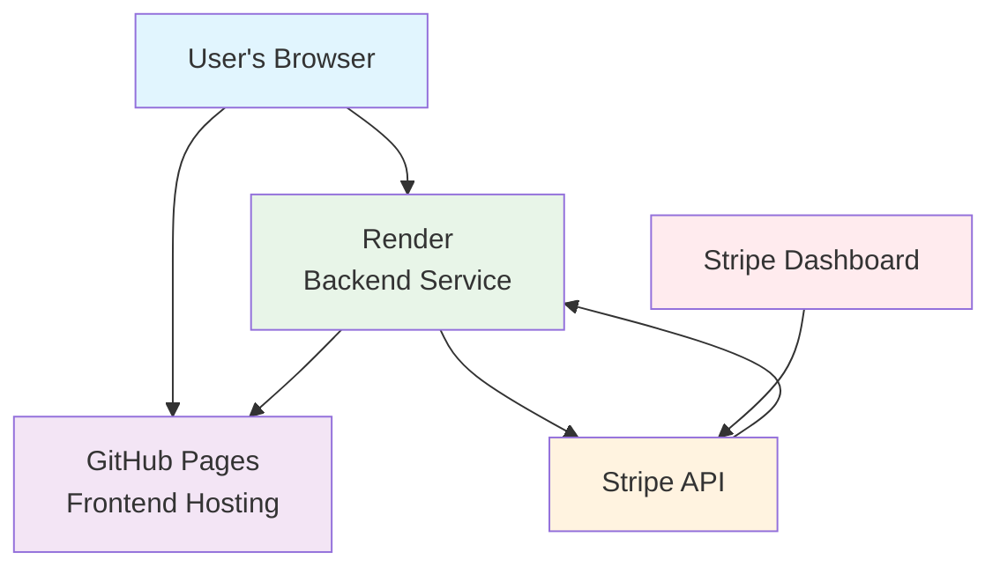

# Tap & Merge Game Architecture

## Components

### 1. Frontend (GitHub Pages)
- Hosts all static files (HTML, CSS, JavaScript)
- Serves the game to users
- Communicates with backend via REST API

### 2. Backend (Render)
- Handles secure Stripe API calls
- Manages payment sessions
- Verifies payment completion
- Never exposes secret keys to frontend

### 3. Stripe
- Processes actual payments
- Handles credit card transactions
- Sends webhook notifications

## Data Flow

1. User clicks "Buy Coins" in the game
2. Frontend sends product selection to backend
3. Backend creates Stripe checkout session
4. Backend returns session ID to frontend
5. Frontend redirects user to Stripe payment page
6. User completes payment on Stripe
7. Stripe redirects user back to game
8. Game verifies payment with backend
9. Backend confirms payment with Stripe
10. Game updates user's coin balance

## Security

- Secret keys remain on backend only
- All API calls use HTTPS
- Transaction data is signed for integrity
- Webhook verification prevents fraud